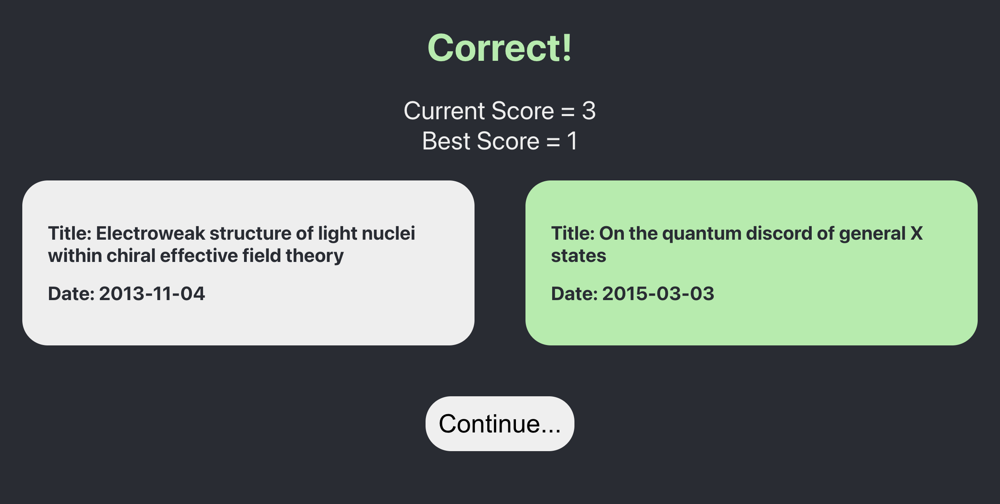

# ArXiv API Demo with ReactJS - The ArXiv Game

A hosted version of the site can be found [here](https://tranquil-starship-92a3ed.netlify.app/)

To view this project locally make sure you have Node.js installed on your machine.

To get started:

- clone this repository onto your machine.
- run `npm install` once in the repository. This will install all necessary dependencies for the project.
- run `npm start` to start the development server.

Game flow:

- New game screen.

- Two random articles are generated. Blocks are emphasized when hovered over and clicking produces the Correct! or Game Over! page 

- On the Correct! and Game Over! pages, the dates of the article are shown and clicking opens the ArXiv page for the article in a new tab.   
