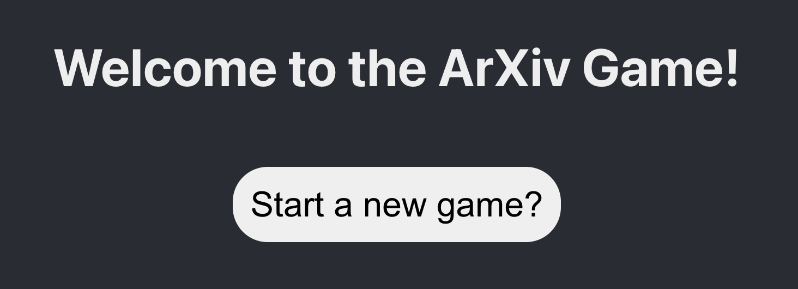
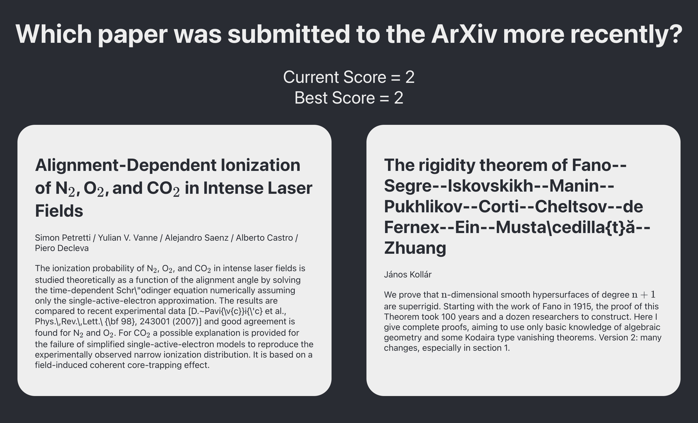
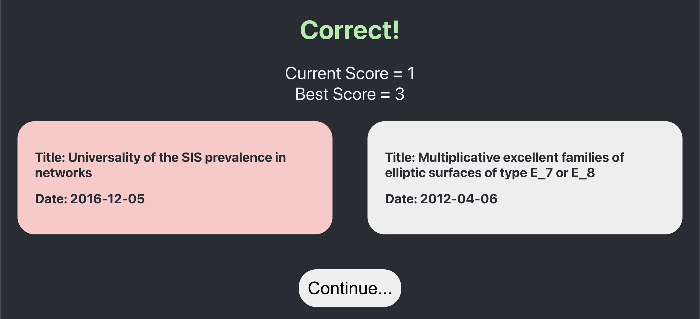
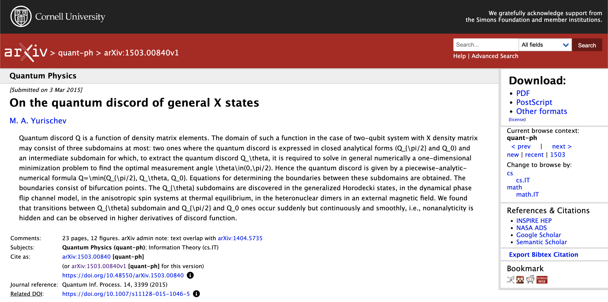
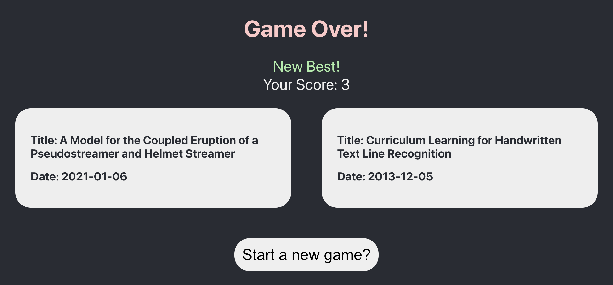

# ArXiv API Demo with ReactJS

To view this project make sure you have Node.js installed on your machine.

To get started: 
- clone this repository onto your machine.
- run `npm install` once in the repository. This will install all necessary dependencies for the project.
- run `npm start` to start the development server.

Game flow:
- New game screen.

- Two random articles are generated. Blocks are highlighted when hovered over and clicking produces transition or game over page 

 - On the transition page and game over pages, the dates of the article are shown and clicking opens the Arxiv page for the article in a new tab.   